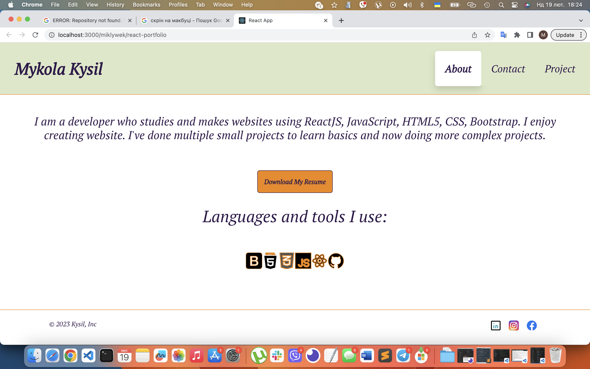
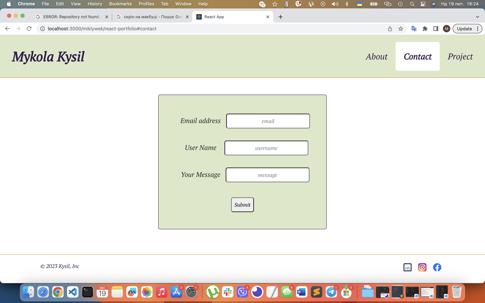
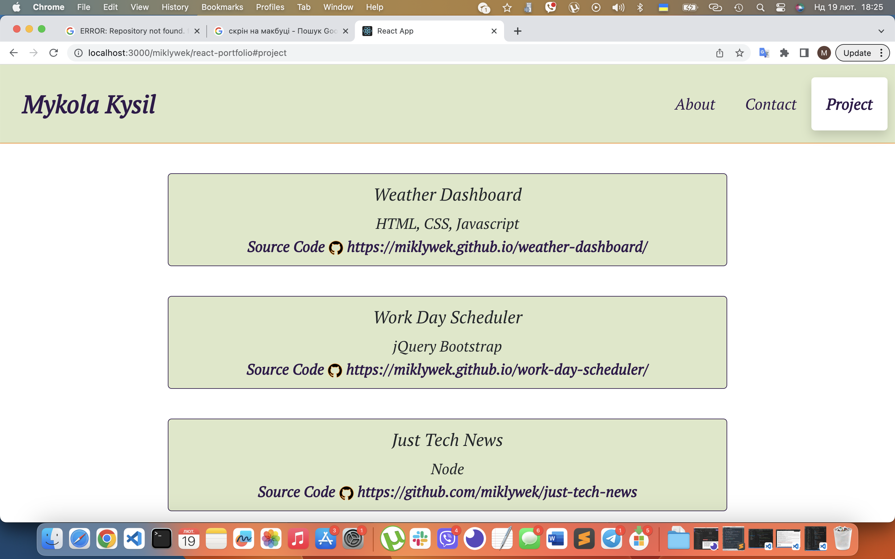

# Kysil Portfolio React

My personal portfolio which features some of my github projects, future learning and technical skills.

## Built With

This project was built using these technologies:

- ReactJS
- React Router DOM
- Bootstrap v5
  
## Getting Started with Create React App

Create React App Globally: Create React App

npx create-react-app app-name

## Installation and Setup Instructions

To get started you need to:

Clone the project
npm install
Install listed dependencies
Scripts - npm start
Runs the app in the development mode. Open http://localhost:3000 to view it in the browser